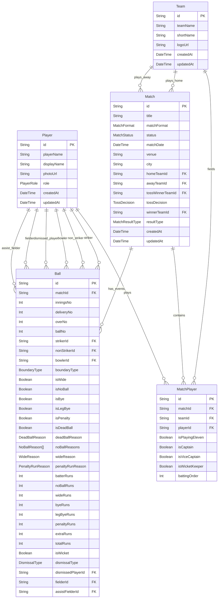

# 🏏 Cricket Score Backend API

[](https://www.typescriptlang.org/)
[](https://expressjs.com/)
[](https://www.prisma.io/)
[](https://www.postgresql.org/)
[](https://vitest.dev/)
[](https://eslint.org/)

A highly optimized, production-grade, and strictly typed Cricket Score Backend API built with **Node.js (ESM)**, **TypeScript**, **Express.js**, and **Prisma ORM** with a native PostgreSQL driver adapter.

---

## 🚀 Key Features

- **Native TypeScript ESM Setup**: Fully configured ESM setup with strict TypeScript compiling (`tsconfig.json` & `tsconfig.build.json`).
- **PostgreSQL & Prisma Integration**: Uses Prisma Client with `@prisma/adapter-pg` for custom connection pooling, fine-tuned idle timeouts, and connection limit limits.
- **Environment Validation**: Runtime environment variable checking powered by `Zod` to prevent server startup on invalid or missing configurations.
- **Robust Security Middlewares**:
  - `helmet`: Custom CSP policies, disabled fingerprinting (`x-powered-by`).
  - `cors`: Dynamic parsing of comma-separated allowed origins with strict wildcard validation blockages in production.
  - `express-rate-limit`: Rate limiter configured to mitigate brute force and DDoS attacks.
- **High Performance**:
  - Gzip compression via `compression`.
  - Structured, high-performance logging via `pino` (pretty-printing in development, raw JSON in production).
- **Graceful Shutdown**: Intercepts `SIGINT`/`SIGTERM` to safely drain connection pools, close open HTTP sockets, and disconnect the database.
- **Centralized Error & 404 Handlers**: Uniform API error format utilizing a dedicated `ApiError` class.
- **Preconfigured Testing Pipeline**: Integration tests utilizing `Vitest`, `Supertest`, and `@vitest/coverage-v8`.

---

## 📁 Project Structure

```text
cricket-backend/
├── .github/
│   └── workflows/
│       └── ci.yml             # GitHub Actions CI pipeline configuration
├── prisma/
│   ├── migrations/            # SQL migration history files
│   ├── schema.prisma          # Database models, relations & enums
│   └── seed.ts                # Database seeder (generates matches, teams, balls)
├── src/
│   ├── config/
│   │   ├── env.ts             # Zod environment variable schemas & runtime validations
│   │   └── prisma.ts          # Prisma Client setup & database pool connections
│   ├── generated/
│   │   └── prisma/            # Auto-generated Prisma client types & outputs
│   ├── middlewares/
│   │   └── error.middleware.ts # API error interceptor and 404 route fallbacks
│   ├── modules/
│   │   └── health/            # Health check module
│   │       ├── health.controller.ts
│   │       └── health.routes.ts
│   ├── routes/
│   │   └── index.ts           # Central router loader mapping all feature modules
│   ├── utils/
│   │   ├── ApiError.ts        # Custom operational API error class
│   │   └── logger.ts          # Structured Pino logger utility
│   ├── app.test.ts            # Integration tests using Vitest & Supertest
│   ├── app.ts                 # Express middleware configuration & app bootstrap
│   └── server.ts              # HTTP listener with server timeouts & graceful shutdown
├── .env.example               # Template environment variables config
├── eslint.config.js           # ESLint flat config rules
├── package.json               # Node.js project manifest & script commands
├── tsconfig.json              # Development compilation options
├── tsconfig.build.json        # Production build-specific compilation options
└── vitest.config.ts           # Vitest unit & integration test configuration
```

---

## ⚙️ Environment Variables Validation

This project relies on runtime checks using `Zod` (`src/config/env.ts`). If any configuration is invalid or missing, the server logs formatting errors and immediately exits (`process.exit(1)`).

> [!WARNING]
> `.env` files contain local secrets. **Never commit `.env` files to git.** Always use `.env.example` as a template.

### Setup Instructions

1.  Copy the environment template file:
    - **Windows PowerShell:** `Copy-Item .env.example .env`
    - **macOS / Linux:** `cp .env.example .env`
2.  Configure database details and origin URLs in `.env`.

### Variables Configuration

| Variable Name             | Type                                    | Default                       | Description                                                                       |
| :------------------------ | :-------------------------------------- | :---------------------------- | :-------------------------------------------------------------------------------- |
| `NODE_ENV`                | `development` \| `production` \| `test` | `development`                 | Runtime environment.                                                              |
| `PORT`                    | `number`                                | `5000`                        | Port server listens to.                                                           |
| `CORS_ORIGIN`             | `string` (comma-separated URLs)         | `*` (dev only)                | Allowed CORS origins. In production, `*` is blocked; exact origins must be set.   |
| `DATABASE_URL`            | `string`                                | _Optional (dev)_              | PostgreSQL connection URL. Required in production.                                |
| `LOG_LEVEL`               | `error` \| `warn` \| `info` \| `debug`  | `debug` (dev) / `info` (prod) | Severity threshhold for the Pino Logger.                                          |
| `REQUEST_BODY_LIMIT`      | `string`                                | `2mb`                         | Maximum JSON request payload limit (e.g. `500kb`, `2mb`).                         |
| `RATE_LIMIT_WINDOW_MS`    | `number`                                | `900000` (15 mins)            | Time window in ms for counting rate-limited requests.                             |
| `RATE_LIMIT_MAX_REQUESTS` | `number`                                | `300`                         | Maximum number of requests allowed in the rate limit window.                      |
| `SHUTDOWN_TIMEOUT_MS`     | `number`                                | `10000`                       | Max milliseconds to wait for active requests to finish during graceful shutdown.  |
| `REQUEST_TIMEOUT_MS`      | `number`                                | `30000`                       | Max milliseconds allowed for receiving an entire request.                         |
| `HEADERS_TIMEOUT_MS`      | `number`                                | `15000`                       | Milliseconds allowed to receive HTTP request headers.                             |
| `KEEP_ALIVE_TIMEOUT_MS`   | `number`                                | `5000`                        | Inactive sockets keep-alive timeout.                                              |
| `TRUST_PROXY`             | `boolean`                               | `false`                       | Enable/disable trusting upstream reverse-proxy headers (e.g., Cloudflare, Nginx). |

---

## 🗄️ Database Models & Schema

The PostgreSQL schema (`prisma/schema.prisma`) represents cricket matches with ball-by-ball granularity:



### 🗂️ Core Models & Enums

- **Enums**:
  - `PlayerRole`: `BATSMAN`, `BOWLER`, `ALL_ROUNDER`, `WICKET_KEEPER`, `WICKET_KEEPER_BATSMAN`, `WICKET_KEEPER_ALL_ROUNDER`
  - `MatchFormat`: `ODI`, `T20`, `T10`
  - `MatchStatus`: `UPCOMING`, `LIVE`, `COMPLETED`, `CANCELLED`, `ABANDONED`
  - `DismissalType`: `BOWLED`, `CAUGHT`, `LBW`, `RUN_OUT`, `STUMPED`, `HIT_WICKET`, `HIT_BALL_TWICE`, `OBSTRUCTING_FIELD`, `TIMED_OUT`, `RETIRED_OUT`
  - `NoBallReason`, `WideReason`, `PenaltyRunReason`, `DeadBallReason`, `MatchResultType`, `TossDecision`
- **Seeder Database (`prisma/seed.ts`)**:
  - Wipes current tables (only runs in production with `FORCE_SEED=true`).
  - Creates teams **Surat Strikers (SRT)** and **Ahmedabad Titans (AMD)** with full lists of famous players (Virat Kohli, Rohit Sharma, MS Dhoni, Jasprit Bumrah, etc.).
  - Builds a completed 10-over Match score (Surat Strikers won by 12 runs, 118/4 vs 106/5) with exact ball-by-ball actions, strike rotations, over boundaries, wickets, and bowlers.

---

## 🛠️ Installation & Commands

### Prerequisites

- **Node.js**: `>= 20.11.0`
- **npm**: Package manager
- **PostgreSQL**: Running instance

### 1. Install Dependencies

```bash
npm install
```

### 2. Database Commands

```bash
# Formats schema.prisma according to standard styling rules
npm run prisma:format

# Validates schema structure
npm run prisma:validate

# Generates typescript types for Prisma Client in src/generated/prisma
npm run prisma:generate

# Runs prisma migrate for development
npm run db:migrate

# Deploys migrations to staging/production
npm run db:deploy

# Runs the database seeder
npm run db:seed

# Launches Prisma Studio on http://localhost:5555
npm run db:studio

# Helper: formats, validates, generates types, and migrates database in one go
npm run db:prepare
```

### 3. Execution Commands

```bash
# Starts development server with hot-reload watch mode (tsx)
npm run dev

# Cleans dist/ and compiles TS files into production JS
npm run build

# Runs production server from dist/server.js with source map support
npm start
```

---

## 🧪 Testing & Quality Checks

We use **Vitest** for running lightweight and parallel integration tests, using **Supertest** to mock HTTP server configurations.

```bash
# Run Vitest test suite in interactive watch mode
npm run test

# Run tests once to completion (CI environments)
npm run test:run

# Run tests with HTML and command-line code coverage
npm run test:coverage
```

### Static Analysis & Code Formatting

```bash
# Check code style violations with Prettier
npm run format:check

# Auto-format codebase files using Prettier
npm run format:write

# Run ESLint validation static rules
npm run lint

# Auto-fix linting warnings and issues
npm run lint:fix

# Run type validation across TypeScript files (without compiling output files)
npm run typecheck

# Full CI Verification Pipeline locally
npm run check
```

---

## 🌐 API Endpoints

### 1. Root Handlers

- **`GET /`**
  - **Description**: Verify API is online.
  - **Response**: `200 OK`
    ```json
    {
      "success": true,
      "message": "Cricket backend API is running"
    }
    ```
- **`GET /health`**
  - **Description**: Exposes service health statistics (uptime, environment details, timestamp). Excluded from rate limit rules and log filters.
  - **Response**: `200 OK`
    ```json
    {
      "success": true,
      "message": "Service healthy",
      "data": {
        "uptime": 12.34,
        "timestamp": "2026-06-18T15:00:00.000Z",
        "environment": "development"
      }
    }
    ```

### 2. Unknown Routes Handler

- **`GET /any-unknown-route`**
  - **Description**: Catch-all endpoint for invalid requests.
  - **Response**: `404 Not Found`
    ```json
    {
      "success": false,
      "message": "Route GET /any-unknown-route not found"
    }
    ```

---

## 🛡️ Reliability & Production Settings

### HTTP Socket and Request Timeouts

The server sets strict limits to prevent Slowloris attacks:

- `requestTimeout`: `30000ms` (Max time allowed to receive client payload request).
- `headersTimeout`: `15000ms` (Max time allowed to receive headers).
- `keepAliveTimeout`: `5000ms` (Inactive sockets are closed after 5s).

### Graceful Shutdown Flow

On receiving termination signals (`SIGINT`/`SIGTERM`) or catching uncaught exceptions:

1.  **Drains connections**: Closes idle connections and HTTP server instantly.
2.  **Applies Grace Timeout**: Waits up to `SHUTDOWN_TIMEOUT_MS` (default 10s) for active requests to finish processing.
3.  **Safely disconnects database**: Closes PostgreSQL prisma connection cleanly.
4.  **Exits cleanly**: Triggers `process.exit(0)` or `process.exit(1)` in case of timeout/uncaught exceptions.
